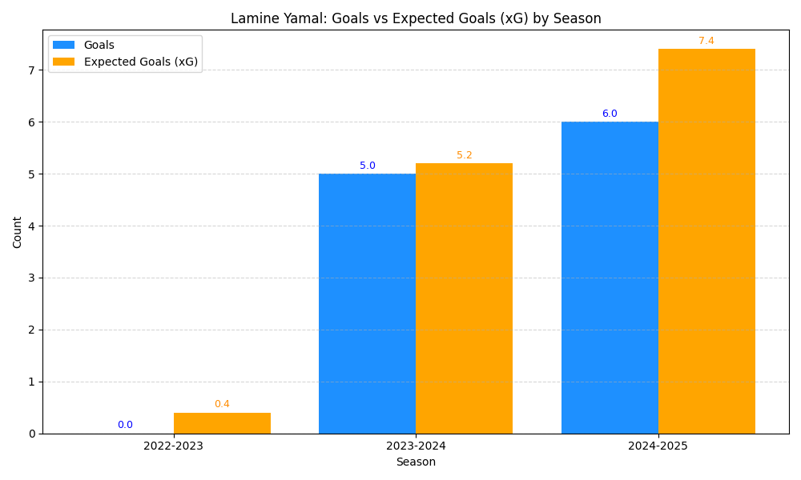

# 📊 Lamine Yamal Shooting Stats Analysis

This project showcases a full data engineering pipeline built in Python — from web scraping shooting statistics of Lamine Yamal (via FBref), to cleaning the data, and generating insightful visualizations.

---

## 📁 Project Structure

```
.
├── data/
│   ├── raw/                        # Raw HTML files
│   └── processed/                  # Cleaned and processed CSVs
├── output/
│   └── plots/                      # Visualizations
├── src/
│   ├── __init__.py
│   ├── data_collection.py         # Scrapes data from FBref
│   ├── data_cleaning.py           # Cleans raw shooting CSV
│   └── data_analysis.py           # Visualizes goals vs xG
├── run_pipeline.py                # 🔁 End-to-end runner (collection → cleaning → plotting)
├── setup.sh                       # ⚙️ Shell script for full setup
├── .gitignore                     # Ignores raw data, HTML, PNGs
├── README.md
├── requirements.txt
└── LICENSE
```

---

## 🚀 Features

- Web scraping from hidden comment-based tables (FBref)
- Automatic folder creation and raw HTML storage
- Clean column renaming, numeric conversion, and filtering
- Cleaned `.csv` output for reuse
- Bar plot comparing Goals vs Expected Goals (xG)

---

## ✅ How to Run the Full Pipeline

> This single script runs everything from start to finish:

```bash
python run_pipeline.py
```

It will:
1. Download and save the raw shooting stats from [FBref](https://fbref.com/en/players/82ec26c1/Lamine-Yamal)
2. Clean and filter the raw data
3. Create a plot comparing Lamine Yamal's actual goals vs expected goals (xG)
4. Save both cleaned data and plot

---

## 📸 Example Output Plot



---

## 🧪 Requirements

Install dependencies via:

```bash
pip install -r requirements.txt
```

**requirements.txt**
```
pandas
beautifulsoup4
matplotlib
requests
```

---

## 🐍 Setup Script (Optional)

You can also use the following to automate the run:

**setup.sh**
```bash
#!/bin/bash
echo "Setting up the project..."
pip install -r requirements.txt
python run_pipeline.py
```

Make it executable:
```bash
chmod +x setup.sh
./setup.sh
```

---

<details>
<summary>🌐 <strong>Publish to GitHub (Public Portfolio)</strong></summary>

1. Create a GitHub repo (e.g., `football-data-pipeline`)
2. In your terminal:

```bash
git init
git add .
git commit -m "Initial commit - football data engineering pipeline"
git branch -M main
git remote add origin https://github.com/YOUR_USERNAME/football-data-pipeline.git
git push -u origin main
```

3. Add a proper description and tags in the GitHub repo (e.g., `data-engineering`, `football`, `portfolio`, `ETL`, `python`)
</details>

---

## 📄 License

This project is licensed under the MIT License.  
Feel free to reuse and modify for personal or educational purposes!

---

> ⭐ Tip: Share this in your resume or LinkedIn to showcase your practical data engineering skills.
